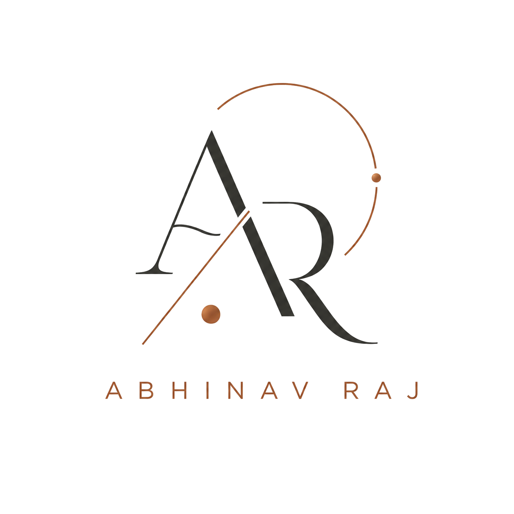
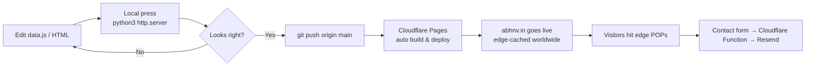

<!-- =====================================================================
     The Build Journal · Abhinav Raj — abhnv.in
     A newspaper-grade personal portfolio.
     ===================================================================== -->

<div align="center">



# The Build Journal

### `Vol. 01` · An editorial portfolio of <a href="https://abhnv.in">Abhinav&nbsp;Raj</a>

<sub>Full-stack developer · AI products · Privacy-minded tools · Editorial web</sub>

<br />

<a href="https://abhnv.in"></a>
<a href="mailto:hello@abhnv.in"></a>
<a href="https://www.linkedin.com/in/abhnv07/"></a>
<a href="https://x.com/Abhnv007"></a>
<a href="https://www.instagram.com/abhinavv.007/"></a>

<br />

<a href="https://github.com/Abhinavv-007/Portfolio/stargazers"></a>
<a href="https://github.com/Abhinavv-007/Portfolio/commits/main"></a>
<a href="https://github.com/Abhinavv-007/Portfolio/pulse"></a>


<br />

<sub><i>"Edition refreshed every commit. Type set in Playfair, set live on the open web."</i></sub>

</div>

<br />

---

## ✦ Front Page

> **The Build Journal** is a personal portfolio that reads like a newspaper. It collects the work, notes, research and credentials of Abhinav Raj across **AI products, privacy tools, and thoughtful web experiences** — in a single editorial system with a paper masthead, a horizontal short-poster work rail, a black menu curtain, and a marquee footer.

<table>
  <tr>
    <td width="50%" valign="top">
      <h3>📰 What it is</h3>
      <p>A static, no-build personal portfolio. Editorial typography, newspaper-cutting avatar, custom cursor, draggable poster rail, paper-texture backdrops. Hand-tuned vanilla JS + CSS. No frameworks. No bundler.</p>
    </td>
    <td width="50%" valign="top">
      <h3>🧭 Where it lives</h3>
      <p>Production: <a href="https://abhnv.in"><b>abhnv.in</b></a><br/>Hosting: Cloudflare Pages with Functions for the Resend-backed contact form.<br/>Asset pipeline: just <code>git push</code>.</p>
    </td>
  </tr>
  <tr>
    <td width="50%" valign="top">
      <h3>🎨 Design language</h3>
      <p>Local Playfair + custom display fonts, halftone paper texture, mono-space sub-decks, a black full-screen <i>menu curtain</i>, torn-paper transitions, and a marquee footer that calls you to email.</p>
    </td>
    <td width="50%" valign="top">
      <h3>⚙️ How it runs</h3>
      <p>One <code>python3 -m http.server</code> away from a perfect local preview. Edit <code>data.js</code> to change projects, notes, social links, email, or profile copy — no rebuild.</p>
    </td>
  </tr>
</table>

---

## ✦ Featured Sections

| Page | Purpose |
| --- | --- |
| `index.html` | Masthead + short-poster <b>Selected Work</b> rail + marquee footer |
| `work.html` | Detailed case studies (CLEX, CLEX AI, Driped, Modih Mail, TRGT) |
| `about.html` | Profile column, newspaper-cutting avatar, builder notes |
| `contact.html` | Contact columns, social links, Resend-backed contact form |
| `certifications.html` | Verified credentials and certificate strip |
| `credentials.html` | Resume, education, ledger of credentials |
| `terminal.html` | A quiet text-mode view of the journal |
| `Aether/` · `Air-Blocks/` · `Dash/` | Static experiment microsites for design demos |

---

## ✦ Selected Work — In This Issue

<table>
  <tr>
    <td width="50%" align="center">
      <a href="https://clex.in"></a>
      <h3><a href="https://clex.in">CLEX</a></h3>
      <p><i>Privacy-first browser workspace for file transfer, browser-side tools, and an encrypted Vault.</i></p>
    </td>
    <td width="50%" align="center">
      <a href="https://ai.clex.in"></a>
      <h3><a href="https://ai.clex.in">CLEX AI</a></h3>
      <p><i>One OpenAI-compatible endpoint that fans out to dozens of models. Built for builders.</i></p>
    </td>
  </tr>
  <tr>
    <td width="50%" align="center">
      <a href="https://driped.in"></a>
      <h3><a href="https://driped.in">Driped</a></h3>
      <p><i>Stop the drip. Detect, tally, and cancel forgotten subscriptions hiding in your inbox.</i></p>
    </td>
    <td width="50%" align="center">
      <a href="https://modih.in"></a>
      <h3><a href="https://modih.in">Modih Mail</a></h3>
      <p><i>Cinematic disposable email at @modih.in — Cloudflare-native, 1-click OTP, 0ms cold start.</i></p>
    </td>
  </tr>
  <tr>
    <td width="50%" align="center">
      <a href="https://trgt.in"></a>
      <h3><a href="https://trgt.in">TRGT</a></h3>
      <p><i>An elite Formula 1 fan platform. Live standings, predictions, circuit telemetry, race intel.</i></p>
    </td>
    <td width="50%" align="center" valign="middle">
      <h3>📚 More in <code>research/</code></h3>
      <p><i>Three working drafts of long-form research lives at <code>research/paper</code>, <code>paper2</code>, <code>paper3</code>. Editorial-first, code-second.</i></p>
    </td>
  </tr>
</table>

---

## ✦ Tech Stack

<p>
  
  
  
  
  
  
  
</p>

> No framework. No bundler. No `package.json` to babysit. The whole thing is a single static folder with a few Cloudflare Functions for the contact form.

---

## ✦ Local Press Run

```bash
# Clone the issue room
git clone https://github.com/Abhinavv-007/Portfolio.git
cd Portfolio

# Run a local press
python3 -m http.server 5173 --bind 127.0.0.1

# Open the front page
open http://127.0.0.1:5173/
```

> Edit `data.js` to change projects, notes, social links, email, or profile copy. The page renders straight from that file — no build step required.

---

## ✦ Edit Map

| File | Purpose |
| --- | --- |
| `data.js` | Editor-friendly source of truth for projects, notes, socials, profile |
| `styles.css` | Design tokens, layout grid, typography, animation system |
| `app.js` | Render + interactions: menu curtain, draggable rail, reveal anim, marquee, mail draft, cursor |
| `case-studies.js` · `case-studies-extras.js` | Long-form work entries |
| `assets/` | Local fonts, posters, logos, portrait, transparent logo, stamp |
| `functions/` | Cloudflare Pages Function for the Resend-backed contact form |

---

## ✦ Pipeline



---

## ✦ Press Box

<table>
  <tr>
    <td><b>📬 Contact</b></td>
    <td><a href="mailto:hello@abhnv.in">hello@abhnv.in</a></td>
  </tr>
  <tr>
    <td><b>🌐 Live edition</b></td>
    <td><a href="https://abhnv.in">abhnv.in</a></td>
  </tr>
  <tr>
    <td><b>🏗 Other ventures</b></td>
    <td><a href="https://clex.in">clex.in</a> · <a href="https://ai.clex.in">ai.clex.in</a> · <a href="https://driped.in">driped.in</a> · <a href="https://modih.in">modih.in</a> · <a href="https://trgt.in">trgt.in</a></td>
  </tr>
</table>

---

## ✦ Star History

<a href="https://star-history.com/#Abhinavv-007/Portfolio&Date">
  
</a>

---

<div align="center">
  <sub>📰 The Build Journal · Set in Playfair Display · Composed and printed by <a href="https://abhnv.in">Abhinav Raj</a>.</sub>
  <br/>
  <sub><i>Edition #</i> · <i>Last impression </i></sub>
</div>
